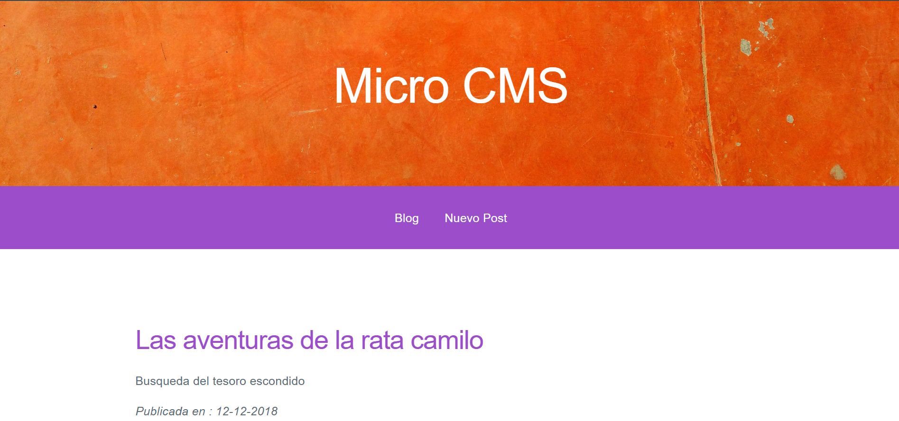
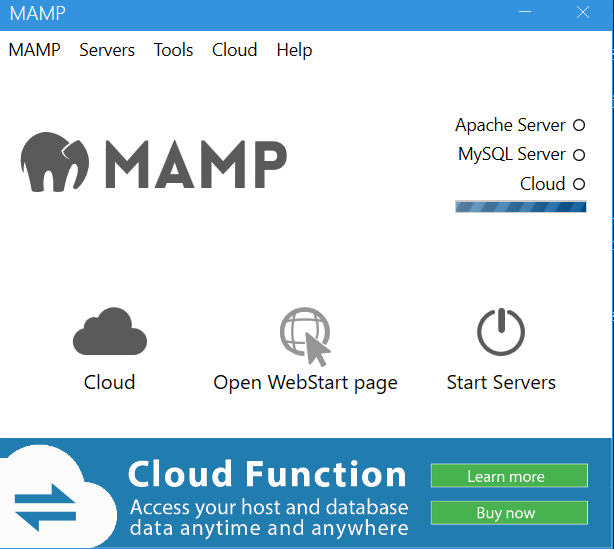
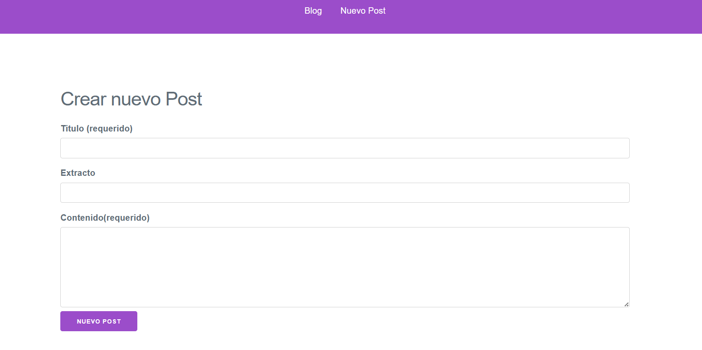

<h1>MICRO CMS(Content Management System)</h1>

Pagina web que gestiona la visualizacion y publicacion de pequeñas historias en un blogpost.

<h2>Tecnologias Usadas</h2>
Se hace uso de HTML, CSS y PHP para la creacion de la pagina web. Para la gestion de base de datos se usa MYSQL y todo esto viene integrado al descargar MAMP que es un entorno de servidor local gratuito con Apache, Nginx, PHP y MySQL para tu ordenador macOS o Windows.
<h2>Instalacion:</h2>
- Descargar MAMP
-Inicializar MAMP y se abrira lo siguiente:

-Damos click en inicializar los servidores

- Luego en la carpeta donde fue instalado MAMP buscamos la carpeta htdocs y creamos una nueva carpeta de nuestro proyecto.

- En esta carpeta realizamos el clonado de este repositorio.

- Luego en nuestro navegador abrimos los siguiente: localhost:$Puerto/nombre-carpeta. El puerto es el puerto apache configurado en MAMPS.

<h2>Funciones de la pagina</h2>
- La pagina principal nos permite observar el nombre de todas las historias publicadas hasta el momento junto con un pequeño resumen de ellas.

-Al hacer click en el nombre de una historia se abrira el contenido completo de esta

-Se puede eliminar una historia haciendo click en la opcion eliminar Post ubicado debajo de cada historia

-Al hacer click en Nuevo post se puede agregar una nueva Historia.

